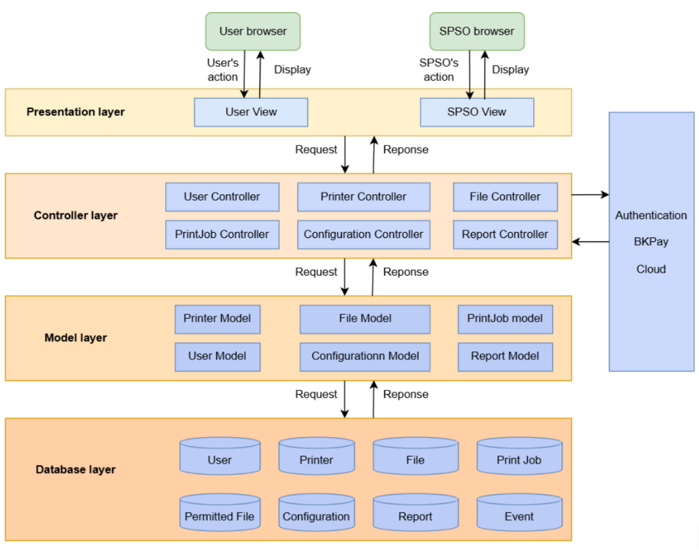

## System Architecture Overview

### 1. **Browser (User Interaction Layer)**

- **Users**: This layer represents general users, including students, teachers, and SPSO (Student Printing Service Officer), who interact with the system through a web browser.
- **Functionality**: Users can perform operations on the user interface, such as navigating pages, printing, downloading files, filling in information, viewing history, and more. These actions will trigger requests that are handled by the **Controller** layer.

### 2. **Presentation Layer (UI/UX)**

- **Role**: The Presentation layer is responsible for managing and setting up the user interface (UI) of the system.
- **Views**: 
  - **User View**: This view caters to general users like students and teachers, providing them with operations related to their printing tasks, file management, and history viewing.
  - **SPSO View**: This view caters to the Student Printing Service Officer (SPSO), who manages printer configurations, user activities, and generates reports.
- **Functionality**: The Presentation layer processes user actions (like button clicks or form submissions) and sends corresponding requests to the **Controller** layer. Once the controller processes these requests, the results are used to update the user's view.

### 3. **Controller Layer (Business Logic and Request Handling)**

- **Role**: The Controller layer is the central part of the system, where all business logic and request handling occurs.
- **Functionality**:
  - Processes requests sent from the Presentation layer (UI).
  - Uses the Model layer to interact with data and perform operations like creating, reading, updating, or deleting data.
  - Returns the processed data back to the Presentation layer to update the user interface.
  - Handles user authentication and authorization to ensure that only authorized users can perform specific actions (such as printing or viewing specific reports).

### 4. **Model Layer (Data Management and Database Interaction)**

- **Role**: The Model layer is responsible for managing the system's data. It interacts directly with the database to perform CRUD operations (Create, Read, Update, Delete).
- **FFunctionality**:
  - **Database Interaction**: This layer performs actions like retrieving data (e.g., user information, print jobs, configurations), inserting new records (e.g., adding a printer), updating existing records, and deleting data as needed.
  - **Data Integrity**: Ensures that all operations related to data are performed correctly and that the integrity of the database is maintained.
