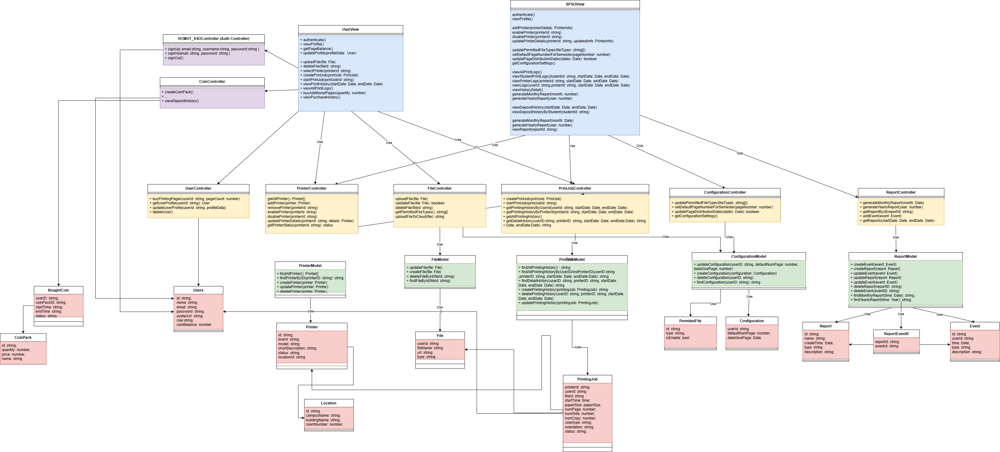

# Class Diagram Description

The Class Diagram is designed based on the MVC (Model-View-Controller) pattern and includes the following layers:

## Model
The Model layer is responsible for managing the system's core data, including information about printers, files, print jobs, and system configurations. It performs operations like create, read, update, and delete (CRUD) data.

### PrinterModel
- `findPrinterByID(printerID: string): string`: Find and retrieve information about a printer based on the provided `printerID`.
- `createPrinter(printer: Printer)`: Create a new printer based on the information provided in the `printer` object.
- `updatePrinter(printer: Printer)`: Update the information of a printer based on the provided `printer` object.
- `deletePrinterByID(printerID: string)`: Delete the specified printer based on the `printerID`.

### FileModel
- `updateFile(file: File)`: Update the information of a file based on the provided `file` object.
- `createFile(file: File)`: Create a new file based on the information provided in the `file` object.
- `deleteFileByID(fileID: string)`: Delete the specified file based on the `fileID`.
- `findFileById(fileId: string)`: Find and retrieve information about a file based on the provided `fileID`.

### PrintingJobModel
- `findAllPrintingHistory(): string`: Find and retrieve all printing history.
- `findAllPrintingHistoryByUserIDAndPrinterID(userID: string, printerID: string, startDate: Date, endDate: Date): string`: Find and filter printing history by `userID`, `printerID`, or time period.
- `findDetailHistory(recordID: string): string`: Find and retrieve the detailed print history of a record.
- `createPrintingHistory(printingJob: PrintingJob): string`: Create a new printing history based on the information provided in the `printingJob` object.
- `updatePrintingHistory(printingJob: PrintingJob)`: Update the information of a printing history record.
- `deletePrintingHistory(userID: string, printerID: string, startDate: Date, endDate: Date)`: Delete a printing history record.

### ConfigurationModel
- `updateConfiguration(configuration: Configuration)`: Update the information of a configuration based on the `configuration` object.
- `createConfiguration(configuration: Configuration)`: Create a configuration based on the information provided in the `configuration` object.
- `deleteConfiguration(userID: string)`: Delete a configuration based on `userID`.
- `findConfiguration(userID: string): string`: Find and retrieve a configuration based on `userID`.

### ReportModel
- `createEvent(event: Event)`: Create an event based on the information provided in the `event` object.
- `createReport(report: Report)`: Create a report based on the information provided in the `report` object.
- `updateEvent(event: Event)`: Update an event based on the information provided in the `event` object.
- `updateReport(report: Report)`: Update a report based on the information provided in the `report` object.
- `deleteReport(reportID: string)`: Delete a report based on `reportID`.
- `deleteEvent(eventID: string)`: Delete an event based on `eventID`.
- `findMonthlyReport(time: Date): string`: Find and retrieve a report for a specific month.
- `findYearlyReport(time: Date): string`: Find and retrieve a report for a specific year.

## View
The View layer is responsible for presenting data from the Model to users through the user interface (UI). It allows users to interact with the system, such as uploading files, creating print jobs, viewing print history, and accessing reports.

### UserView
Manages the interface and functions for users, including:
- `uploadFile(file: File)`: Upload a file.
- `deleteFile(field: string)`: Delete an uploaded file.
- `selectPrinter(printerId: string)`: Select a printer.
- `createPrintJob(printJob: PrintJob)`: Create a print job.
- `startPrintJob(printJobId: string)`: Start a print job.
- `viewPrintJobHistory(startDate: Date, endDate: Date)`: View print job history within a date range.
- `viewAllPrintLogs()`: View all print logs.

### SPSOView
Manages the interface and functions for administrators (SPSO), including:
- `addPrinter(printerDetails: PrinterInfo)`: Add a printer.
- `enablePrinter(printerId: string)`: Enable a printer.
- `disablePrinter(printerId: string)`: Disable a printer.
- `updatePrinterDetails(printerId: string, updateInfo: PrinterInfo)`: Update printer information.
- `setPageNumberForSemester(pageNumber: number)`: Set the number of pages for each semester.
- `generateMonthlyReport(month: number)`: Generate a monthly report.
- `generateYearlyReport(year: number)`: Generate a yearly report.
- `viewStudentPrintLogs(studentId: string, startDate: Date, endDate: Date)`: View print logs of a student.
- `viewPrinterLogs(printerId: string, startDate: Date, endDate: Date)`: View print logs of a printer.

## Controller
The Controller layer receives requests from the View, processes them by invoking corresponding methods in the Model, and then returns the results to the View. It implements complex business logic, such as creating print jobs, managing printer statuses, and updating user information.

### PrinterController
Manages operations related to printers:
- `getAllPrinter()`: Retrieve a list of all printers.
- `addPrinter(printer: Printer)`: Add a new printer.
- `removePrinter(printerId: string)`: Remove a printer.
- `enablePrinter(printerId: string)`: Enable a printer.
- `disablePrinter(printerId: string)`: Disable a printer.
- `updatePrinterDetails(printerId: string, details: Printer)`: Update detailed information of a printer.
- `getPrinterStatus(printerId: string)`: Get the status of a printer.

### FileController
Manages operations related to files:
- `uploadFile(file: File)`: Upload a file.
- `validateFile(file: File)`: Validate the file.
- `deleteFile(fileId: string)`: Delete a file.
- `getPermittedFileTypes()`: Get a list of allowed file types.
- `uploadFileToCloud(file: File)`: Upload a file to the cloud.

### PrintJobController
Manages operations related to print jobs:
- `createPrintJob(printJob: PrintJob)`: Create a print job.
- `startPrintJob(printJobId: string)`: Start a print job.
- `getPrintingHistoryByUserId(userId: string, startDate: Date, endDate: Date)`: Retrieve a user's print history.
- `getPrintingHistoryByPrinterId(printerId: string, startDate: Date, endDate: Date)`: Retrieve print history by printer.
- `getAllPrintingHistory()`: Retrieve all print history.

### ConfigurationRouter
Manages system configurations:
- `updatePermittedFileTypes(fileTypes: string[])`: Update allowed file types.
- `setDefaultPageNumberForSemester(pageNumber: number)`: Set the default page number for each semester.
- `updatePageDistributionDates(dates: Date[])`: Update page distribution dates.
- `getConfigurationSettings()`: Get current configuration settings.

## Database
In the MVC (Model-View-Controller) pattern, the database plays a crucial role in the Model component. The database is used to store, retrieve, and update the application's data.

### Printer
Manages printer information, including:
- `id`: Identification number of the printer.
- `brand`: Brand of the printer.
- `model`: Printer model.
- `shortDescription`: Short description of the printer.
- `status`: Operational status of the printer.
- `imageUrl`: URL of the printer's image.
- `location`: Printer's location, linked to the `Location` class.

### Location
Manages location information of the printer, including:
- `campusName`: Name of the campus.
- `buildingName`: Name of the building.
- `roomNumber`: Room number.

### File
Stores information about files uploaded by users, including:
- `userId`: ID of the user who uploaded the file.
- `name`: Name of the file.
- `url`: Link to the file.
- `type`: Type of the file.

### PrintJob
Stores information about print jobs, including:
- `paperSize`: Size of the paper.
- `numPage`: Number of pages.
- `numCopy`: Number of copies.
- `number`: Print job number.
- `color`: Whether the print is in color.
- `orientation`: Paper orientation (portrait/landscape).
- `printerId`: ID of the printer used for the job.
- `status`: Status of the print job.
- `startDate` and `endDate`: Start and end dates of the print job.

### Configuration
Stores system configurations, including:
- `defaultPageNumber`: Default number of pages per semester.
- `pageDistributionDates`: Dates for page distribution.
- `permittedFile`: Allowed file types for printing.
