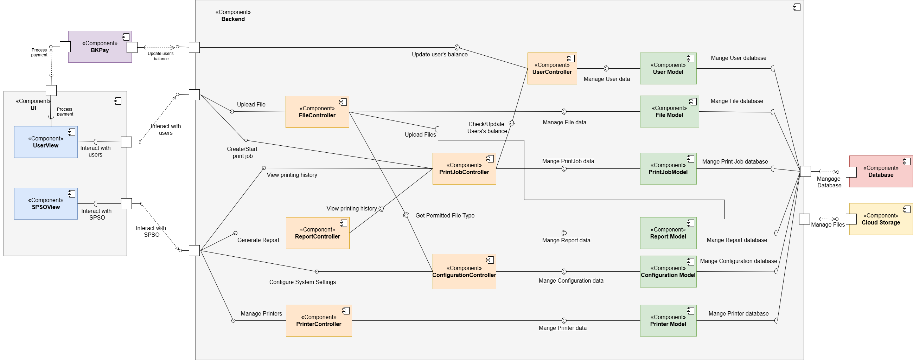

# Component diagram

This system handles print jobs, user management, and file storage for a printing service. It processes payments, manages printer configurations, and generates reports for system administrators.

## Database:
- **Stores**: User, print job, report, configuration, printer data, and file’s metadata.

## Cloud Storage:
- **Stores**: User’s files.

## BKPay:
- **Processes**: Payments and updates the user’s balance.

---

## Backend:

### Models:
- **User Model**: Interacts with the user database to manage user-related data (id, name, email, coin balance, etc.).
- **File Model**: Connects with the file database to store and retrieve file’s metadata (filename, size, path, etc.).
- **Print Job Model**: Links to the print job database to manage print job information (printer id, time, number of pages, etc.).
- **Report Model**: Connects to the report database to manage reports.
- **Configuration Model**: Connects to the configuration database to manage system settings.
- **Printer Model**: Connects to the printer database to manage printers’ information.

### Controllers:
- **User Controller**: Manages user data, including balance updates and other user-related actions.
- **File Controller**: Manages file upload operations and ensures files are appropriately stored.
- **Print Job Controller**: Responsible for creating and managing print jobs, validating user balance, and handling file types for print jobs.
- **Report Controller**: Generates reports.
- **Configuration Controller**: Configures system settings based on SPSO’s preferences.
- **Printer Controller**: Manages the list of printers.

---

## UI Components:

- **User View**: Handles user interactions related to printing documents and managing balances.
- **SPOS View**: Manages interactions between SPSOs and the system.

---

## Interfaces Between UI and Backend Components:
- **Process Payment**: Allows UI to initiate a payment request to BKPay.
- **Upload File**: Interface for UI to upload files, managed by File Controller.
- **Create/Start Print Job**: For users to initiate print jobs.
- **View Printing History**: Interface for UI to view print job history from Print Job Controller.
- **Generate Report**: Interface for SPSOs to get detailed reports using Report Controller.
- **Manage Printers**: Interface for SPSOs to manage connected printers.

---

## Interfaces Between Controller Components:
- **Update User’s Balance (BKPay ↔ UserController)**: Allows BKPay to update the user’s balance after a payment is processed.
- **Check/Update User’s Balance (Print Job Controller ↔ User Controller)**: Interacts with User Controller to verify that the user has sufficient funds to initiate a print job and updates it after finishing a print job.
- **View Printing History (Report Controller ↔ Print Job Controller)**: Report Controller uses this interface to retrieve data on previous print jobs, which can then be included in reports.
- **Get Permitted File Type (File Controller ↔ Configuration Controller)**: File Controller checks the permitted file type using this interface to ensure the uploaded file is valid.
